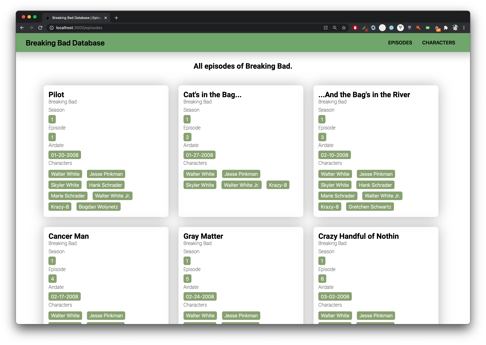
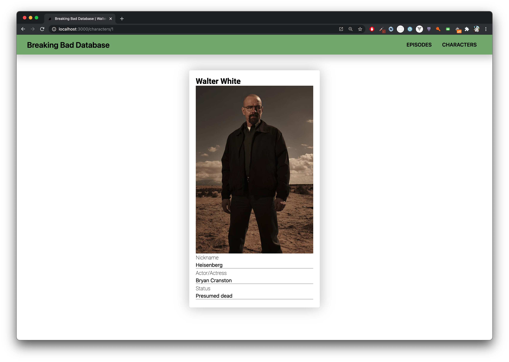

# Breaking Bad NextJS Try


## Getting Started

First, run the development server:

```bash
npm run dev
# or
yarn dev
```

## The Application
This was my first try to write code with [Next.js](https://nextjs.org/). I wanted a [Next.js](https://nextjs.org/) application with data from an API. For this project I use the Breaking Bad API for the usable data.

### Static pages
There are 2 static pages, one with an overview of all the characters from *Breaking Bad* and the second one is a page with a list of all the episodes of *Breaking Bad* and *Better call Saul*. In the image below I show the overview of all the characters.


### Dynamic pages
All the characters have an dynamic page based on the Breaking Bad API. Every character have their own pages with some extra information. See the image with more information than the character list. The data I use for the dynamic pages are *name*, *img* , *nickname* , *portrayed* and *status*.


